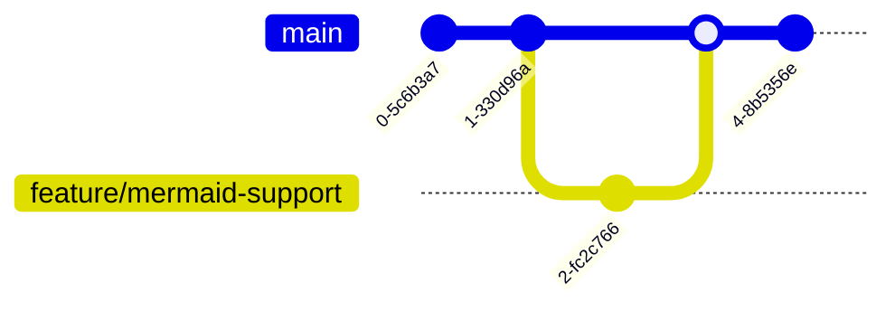

- [Using Mermaid in Jekyll Posts](#using-mermaid-in-jekyll-posts)
  - [How to Use Mermaid Diagrams](#how-to-use-mermaid-diagrams)
    - [Example 1: Flowchart](#example-1-flowchart)
    - [Example 2: Sequence Diagram](#example-2-sequence-diagram)
    - [Example 3: Class Diagram](#example-3-class-diagram)
    - [Example 4: State Diagram](#example-4-state-diagram)
    - [Example 5: Gantt Chart](#example-5-gantt-chart)
    - [Example 6: Pie Chart](#example-6-pie-chart)
    - [Example 7: Git Graph](#example-7-git-graph)
    - [Example 8: Entity Relationship Diagram (ER)](#example-8-entity-relationship-diagram-er)
  - [Supported Diagram Types](#supported-diagram-types)
  - [More Information](#more-information)

# Using Mermaid in Jekyll Posts

Mermaid support has been successfully added to your Jekyll site!

## How to Use Mermaid Diagrams

In your markdown posts, simply use fenced code blocks with `mermaid` language identifier:

### Example 1: Flowchart

```
graph TD
    A[Start] --> B{Decision}
    B -->|Yes| C[Action 1]
    B -->|No| D[Action 2]
    C --> E[End]
    D --> E
```


### Example 2: Sequence Diagram

```
sequenceDiagram
    participant User
    participant System
    User->>System: Request
    System-->>User: Response
```


### Example 3: Class Diagram

```
classDiagram
    class Animal {
        +String name
        +int age
        +makeSound()
    }
    class Dog {
        +bark()
    }
    Animal <|-- Dog
```


### Example 4: State Diagram

```
stateDiagram-v2
    [*] --> Idle
    Idle --> Processing: Start
    Processing --> Success: Complete
    Processing --> Failed: Error
    Success --> [*]
    Failed --> Idle: Retry
```


### Example 5: Gantt Chart

```
gantt
    title Project Timeline
    dateFormat YYYY-MM-DD
    section Phase 1
    Task 1 :a1, 2025-01-01, 30d
    Task 2 :after a1, 20d
    section Phase 2
    Task 3 :2025-02-15, 25d
```


### Example 6: Pie Chart

```text
pie
    title Project Allocation
    "Design" : 40
    "Development" : 35
    "Testing" : 15
    "Documentation" : 10
```


### Example 7: Git Graph

```text
gitGraph
    commit
    commit
    branch feature/mermaid-support
    commit
    checkout main
    merge feature/mermaid-support
    commit
```



### Example 8: Entity Relationship Diagram (ER)

```text
erDiagram
    CUSTOMER ||--o{ ORDER : places
    ORDER ||--|{ LINE_ITEM : contains
    CUSTOMER }|..|{ DELIVERY_ADDRESS : uses
```


## Supported Diagram Types

- Flowchart
- Sequence Diagram
- Class Diagram
- State Diagram
- Entity Relationship Diagram
- User Journey
- Gantt Chart
- Pie Chart
- Git Graph
- And more!

## More Information

For complete documentation, visit: [Mermaid documentation](https://mermaid.js.org/)
