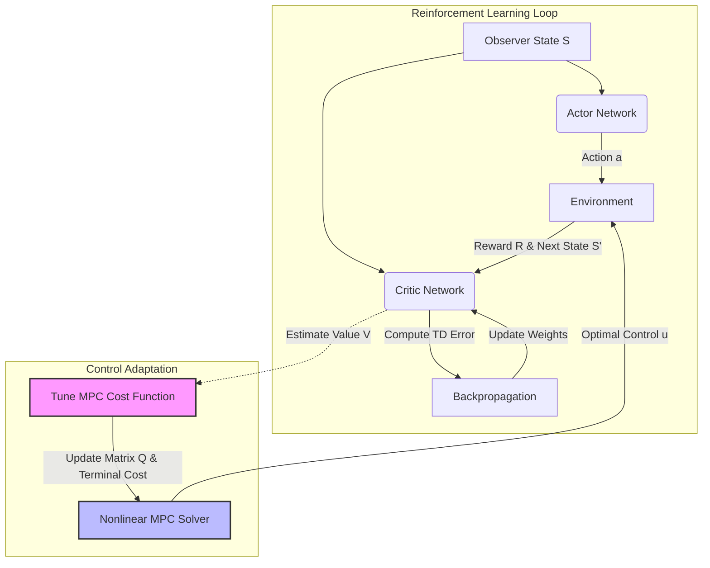

In the world of autonomous systems and robotics, a debate often rages between classical control theory (like Model Predictive Control or MPC) and modern data-driven approaches (like Reinforcement Learning or RL). 

Based on a deep-dive analysis of a hybrid control architecture, this article explains how we can stop choosing between the two and instead combine them. Specifically, we look at how an **Actor-Critic RL architecture** can be used to tune the cost function of a **Nonlinear MPC**, effectively bridging the gap between finite-horizon planning and infinite-horizon optimality.

## The Architecture: Actor, Critic, and the Observer

At the heart of this hybrid approach is the standard Reinforcement Learning (RL) setup, but interpreted through the lens of Control Theory.

### 1. The Observer State vs. Physical State
In classical control, we deal with system states ($x$), such as position or velocity ($x, \dot{x}$). However, in RL, the "state" ($S$) is an observation that can be more abstract. 
* **Physical State ($x$):** The actual physics (e.g., coordinates).
* **Observer State ($S$):** A logical state fed into the neural network (e.g., $\cos(x)$, errors, or transformed features).

The architecture utilizes an **Actor-Critic** model:
* **Actor:** Takes the state $S$ and outputs an action $a$ (or control input $u$).
* **Critic:** Evaluates the state and action to estimate the "Value" of being in that state.

## The Core Problem: Finite vs. Infinite Horizons

The central insight from the video is the relationship between MPC and the Markov Decision Process (MDP).

* **MPC (Model Predictive Control):** Solves an optimization problem over a **finite horizon** (e.g., looking 10 steps into the future). It generates a policy denoted as $P_{MPC}$.
* **MDP (Markov Decision Process):** Represents the **infinite horizon** problem—the "perfect" theoretical solution that considers the environment forever. It generates a policy $P_{MDP}$.

Ideally, we want our practical controller ($P_{MPC}$) to behave exactly like the optimal theoretical controller ($P_{MDP}$). 

### The "Terminal Cost" Solution
How do we make a controller that only looks 5 seconds ahead act like it sees forever? The answer lies in the **Terminal Cost**. 

In MPC, the cost function $J$ is usually composed of:
1.  **Stage Cost:** The immediate cost of running the system (tracking error, energy usage).
2.  **Terminal Cost:** The cost assigned to the final state at the end of the horizon.

If the Terminal Cost is perfectly tuned to represent the "Cost-to-Go" (the cost from that point to infinity), the short-sighted MPC becomes equivalent to the infinite-horizon optimal controller.

## Tuning MPC with the Critic

This is where Reinforcement Learning shines. We don't just use RL to control the robot directly (which can be unstable/unsafe); we use RL to **tune the MPC parameters**.

1.  **The Critic's Role:** The Critic network learns the Value function (V) via the Bellman equation:
    
    $$V(s) = R + \gamma V(s')$$
    
    This Value function essentially represents the "infinite future cost."

2.  **Mapping:** We force the MPC's **Terminal Cost** to approximate this learned Value function ($V(s)$).

3.  **Updating Weights:** The RL agent minimizes the **Temporal Difference (TD) Error**. As the TD error shrinks (implying the reward is being maximized), the Critic provides a better estimate of the true cost. We then update the weighting matrices (Q and R) of the MPC cost function based on these estimates.

### The Workflow
The following flowchart illustrates this symbiotic relationship:

## From Training to Deployment

The process described is primarily a **training strategy**. 

1.  **Training Phase:** You run the system. The Critic observes the performance and updates the parameters (tuning $Q$ and Terminal Cost weights) until the TD error is minimized.
2.  **Convergence:** Once the TD error is minimal, the parameters ($Q$, $R$) are considered optimal.
3.  **Deployment:** You "freeze" these tuned parameters and export them. The deployed system runs a standard Nonlinear MPC solver (using tools like CasADi or IPOPT) using these optimized weights.

This approach ensures that the deployed controller is deterministic and safe (thanks to MPC constraints) but optimized for long-term performance (thanks to RL).

## Conclusion

This method demonstrates that we don't need to discard physical models to use AI. By using Deep Reinforcement Learning to strictly tune the **Terminal Cost** and weighting matrices of a Nonlinear MPC, we achieve a controller that satisfies physical constraints while approaching global optimality.

*Reference: This article is based on the technical breakdown of RL + Nonlinear MPC architecture by Đạt Vũ.*