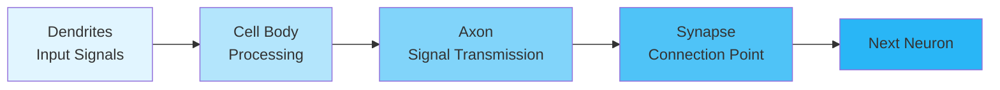
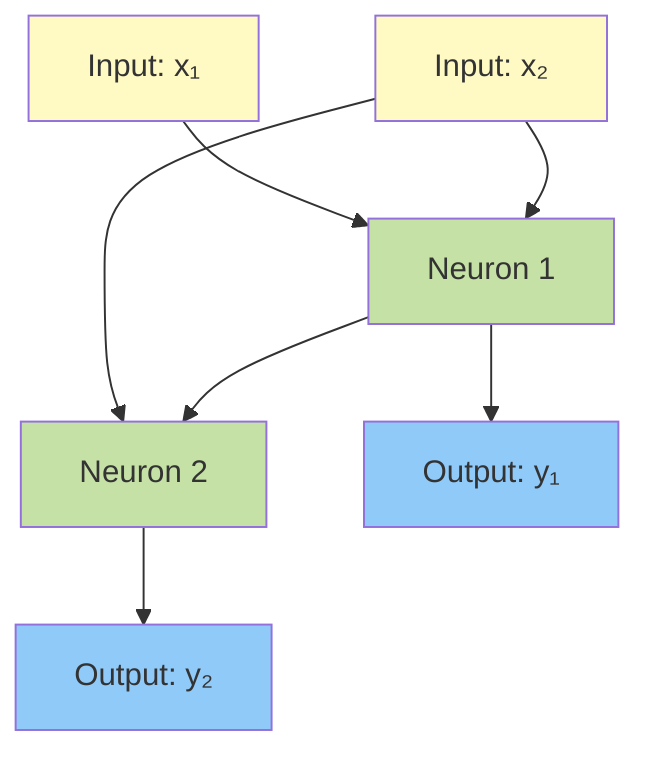
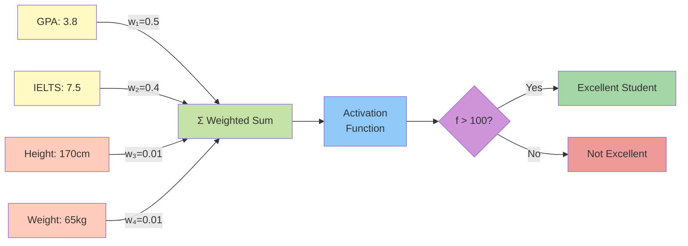
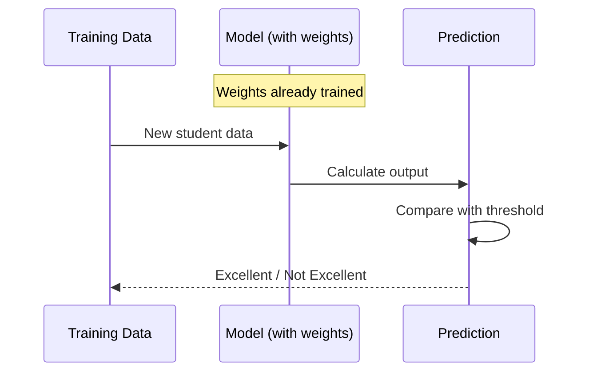
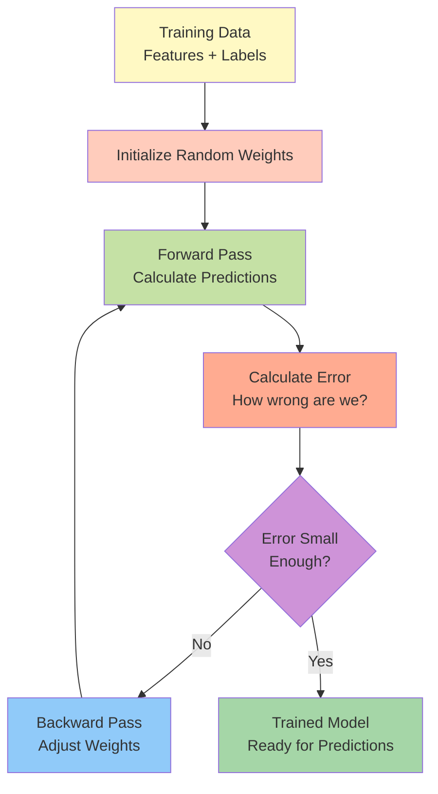
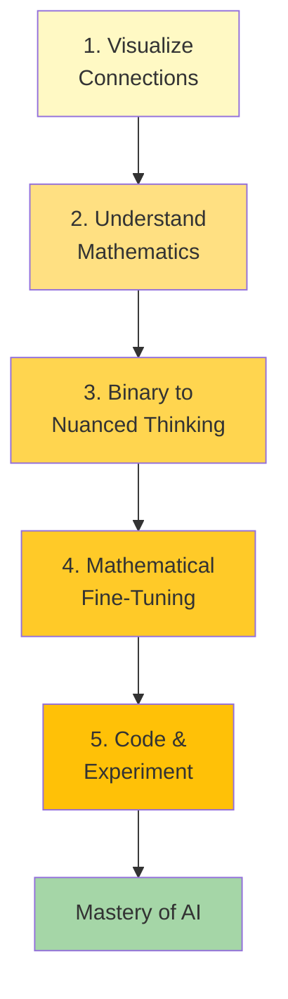
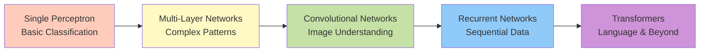

## Introduction

Artificial intelligence has revolutionized our world, but at its core lies a beautifully simple concept: **connection**. Just as neurons in the human brain form intricate networks to create thought and consciousness, artificial neural networks leverage mathematical connections to achieve remarkable intelligence. This article demystifies the fundamental principles that power modern AI systems.


---

## The Biological Inspiration: How Nature Designed Intelligence

The human brain is nature's masterpiece of parallel processing. Within its folds lie approximately 86 billion neurons, each connected to thousands of others through synaptic junctions. When an electrical impulse fires, it cascades through these networks, creating the phenomenon we call thought.



Medical research has proven that these connections are the foundation of human cognition. This insight sparked a revolution: **what if we could recreate this structure mathematically?**

### From Physical to Mathematical

Artificial neural networks don't replicate the physical structure of biological neurons. Instead, they capture the essence of connection through mathematical functions. While a biological neuron is a physical entity with dendrites, axons, and synapses, an artificial neuron is simply a function—an elegant equation that transforms inputs into outputs.

---

## The Power of Connection: AI's Fundamental Principle

> **Key Insight**: Connection is the critical keyword that unlocks everything in AI. Without understanding connections, you're merely copying code without grasping the underlying intelligence.

Many aspiring AI practitioners struggle because they rush to use pre-built frameworks without understanding the foundational concepts. They miss the forest for the trees. The secret? **Master connections first, everything else follows.**

### Connections as Mathematical Relationships

Consider this simple system of equations:

```
Equation 1: y₁ = w₁₁x₁ + w₁₂x₂ + b₁
Equation 2: y₂ = w₂₁y₁ + w₂₂x₂ + b₂
```

Notice how Equation 2 depends on the output of Equation 1? That's a connection. This dependency creates a **network** where information flows from one node to another. Scale this to millions of equations, and you have a neural network.



### Why Nonlinearity Matters

To create truly intelligent systems, we need **nonlinear functions**. Linear systems can only solve simple problems—they're like a brain without wrinkles. Nonlinearity adds complexity, allowing networks to capture intricate patterns in data. Think of it as adding "wrinkles to the brain" (though mathematically, it's about function complexity, not geometry).

---

## The Perceptron: AI's Fundamental Building Block

The perceptron is the atomic unit of neural networks. Understanding how a single perceptron "thinks" unlocks the mystery of how entire networks achieve intelligence.

### Anatomy of an Artificial Neuron



**How It Works:**

1. **Inputs**: The neuron receives multiple inputs (GPA, IELTS score, height, weight)
2. **Weights**: Each input has an associated weight representing its importance
3. **Weighted Sum**: The neuron multiplies each input by its weight and sums them
4. **Activation**: An activation function transforms the sum into an output
5. **Decision**: The output is compared against a threshold to make a decision

### The Intelligence in Weights

Notice something crucial: **GPA and IELTS have weights of 0.5 and 0.4, while height and weight have weights of only 0.01**. The network has learned that academic metrics matter for predicting excellent students, while physical attributes don't.

This is the essence of AI: **discovering which features matter and by how much.**

---

## The Learning Process: From Data to Intelligence

There are two fundamental operations in neural networks:

### 1. Forward Propagation (Prediction)

When you have trained weights, you feed in new data and get predictions. This is the "solving forward" approach—you already know the weights and just calculate the output.



### 2. Backward Propagation (Training)

When you have data with known outcomes, you work backward to find the weights that best explain the data. This is the heart of machine learning.



---

## The Five Steps to Mastering AI

Based on practical experience, here's a roadmap to truly understanding artificial intelligence:

### Step 1: Visualize Connections
Understand how information flows through the network. Draw diagrams. Trace paths. See the data moving from input to output.

### Step 2: Understand the Mathematics
Learn how mathematical operations (multiplication, addition, activation functions) transform data at each step. You don't need a PhD, but you need intuition.

### Step 3: Move from Binary to Nuanced Thinking
AI isn't just about yes/no decisions. Learn how networks handle probabilities, classifications, and continuous predictions.

### Step 4: Master Mathematical Fine-Tuning
Explore optimization algorithms, learning rates, regularization techniques that make networks converge to good solutions.

### Step 5: Code and Experiment
Theory without practice is hollow. Build networks, train them, break them, fix them. Each experiment validates your understanding.



---

## The Threshold: AI's Only Decision Mechanism

Here's a profound truth: **AI has only one way to make decisions—comparing values to thresholds.**

Every classification, every prediction, every generated word ultimately boils down to comparing numbers and choosing the highest, or checking if a value exceeds a threshold.

- Is this image a cat or dog? → Whichever score is higher
- Should this email be marked as spam? → If spam probability > 0.5
- What word comes next in this sentence? → The word with the highest probability

The magic lies not in the comparison itself, but in the **mathematical transformations** that create meaningful numbers to compare. This is where the artistry of neural network architecture comes in.

---

## From Simple Perceptrons to Complex Intelligence

The journey from understanding a single perceptron to grasping modern transformers is one of scaling and sophistication:



Each evolution maintains the same core principles:
- **Connections** between layers
- **Weights** that encode importance
- **Nonlinear transformations** that add complexity
- **Threshold comparisons** that generate outputs

---

## Practical Example: Predicting Student Excellence

Let's bring this all together with our earlier example:

**Scenario**: Predict if a student will achieve "Excellent Student" status.

**Inputs**:
- GPA: 3.8/4.0
- IELTS: 7.5/9.0
- Conduct Score: 95/100
- Height: 170cm
- Weight: 65kg

**Trained Weights** (discovered through training):
- w₁ (GPA): 0.50
- w₂ (IELTS): 0.40
- w₃ (Conduct): 0.08
- w₄ (Height): 0.01
- w₅ (Weight): 0.01

**Calculation**:
```
f(x) = (3.8 × 0.50) + (7.5 × 0.40) + (95 × 0.08) + (170 × 0.01) + (65 × 0.01)
f(x) = 1.9 + 3.0 + 7.6 + 1.7 + 0.65
f(x) = 14.85
```

Wait, this doesn't match our threshold of 100! In practice, we would normalize inputs and adjust the threshold. But the principle remains: **weighted sum → activation → threshold comparison → decision**.

---

## Conclusion: The Beauty of Simplicity

Artificial neural networks, despite their reputation for complexity, are built on elegantly simple principles:

1. **Connection**: Information flows through mathematical relationships
2. **Weights**: Importance is encoded in numerical values
3. **Transformation**: Nonlinear functions add sophistication
4. **Comparison**: Thresholds turn numbers into decisions

Master these fundamentals, and the path to understanding transformers, attention mechanisms, and cutting-edge AI becomes clear. The complexity lies not in the concepts, but in the scale and creativity of their application.

Remember: before diving into pre-built frameworks and libraries, invest time in understanding these core principles. Your journey in AI will be infinitely richer when you grasp not just *how* to use these tools, but *why* they work.

---

## Further Reading

- [Deep Learning Book by Ian Goodfellow](http://www.deeplearningbook.org/)
- [Neural Networks and Deep Learning by Michael Nielsen](http://neuralnetworksanddeeplearning.com/)
- [Understanding LSTM Networks by Christopher Olah](https://colah.github.io/posts/2015-08-Understanding-LSTMs/)

---

*This article is based on educational material by Vũ Tiến Đạt on [Transformers and Attention Mechanisms](/assets/pdf/transformers-and-attention-mechanism.pdf). Translated and adapted for English-speaking audiences.*