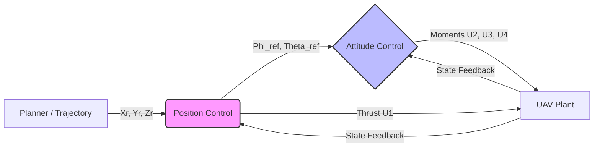

<figure class="figure">
  
  <figcaption class="figure-caption">Thiết Kế Hệ Thống Điều Khiển UAV Hiện Đại</figcaption>
</figure>

> *A comprehensive guide to designing robust hierarchical control systems for autonomous drones, bridging the gap between theoretical dynamics and practical implementation.*

Designing a control system for an Unmanned Aerial Vehicle (UAV), such as a quadcopter, is one of the most intellectually satisfying challenges in robotics. It requires a confluence of rigid body dynamics, optimization theory, and software engineering.

In this article, we will deconstruct a high-performance control architecture designed to allow a UAV to track a trajectory from point A to point B with precision and safety. We will move beyond simple PID loops and explore a hierarchical approach utilizing **Feedback Linearization** for position control and **Linear Parameter-Varying Model Predictive Control (LPV-MPC)** for attitude control. Finally, we will address the critical aspect of safety using **Control Barrier Functions (CBF)** to navigate obstacles dynamically.

---

## The Hierarchical Control Architecture

Before diving into the differential equations, we must visualize the system. A UAV control system is best viewed as a **cascaded (or hierarchical) architecture**.

We separate the problem into two distinct domains:
1.  **Outer Loop (Position Control):** Slow dynamics. Operates in the **Inertial Frame**. It calculates the necessary thrust and orientation (roll, pitch, yaw) required to move the drone to a specific coordinate ($x, y, z$).
2.  **Inner Loop (Attitude Control):** Fast dynamics. Operates in the **Body Frame**. It takes the desired orientation from the outer loop and calculates the motor torques ($u_2, u_3, u_4$) to achieve those angles.

This separation allows us to use different control strategies best suited for each domain.

---

## 1. The Mathematical Foundation: Coordinate Frames

To control a UAV, you must master the coordinate transformations. We deal with two primary frames:
*   **Inertial Frame ($I$):** Fixed to the earth (North-East-Down or similar). Used for position ($x, y, z$).
*   **Body Frame ($B$):** Attached to the center of the drone. Used for angular rates ($p, q, r$) and thrust.

### The Kinematics
The relationship between the translational velocities in the inertial frame ($\dot{x}, \dot{y}, \dot{z}$) and the velocities in the body frame ($u, v, w$) is governed by the Rotation Matrix $R$:

$$
\begin{bmatrix} \dot{x} \\ \dot{y} \\ \dot{z} \end{bmatrix} = R(\phi, \theta, \psi) \begin{bmatrix} u \\ v \\ w \end{bmatrix}
$$

However, rotational kinematics are trickier. The rate of change of Euler angles ($\dot{\phi}, \dot{\theta}, \dot{\psi}$) is **not** the same as the body angular rates ($p, q, r$). They are related by the Transfer Matrix $T$:

$$
\begin{bmatrix} \dot{\phi} \\ \dot{\theta} \\ \dot{\psi} \end{bmatrix} = T(\phi, \theta) \begin{bmatrix} p \\ q \\ r \end{bmatrix}
$$

Where $T$ is defined as:

$$
T = \begin{bmatrix} 
1 & \sin(\phi)\tan(\theta) & \cos(\phi)\tan(\theta) \\
0 & \cos(\phi) & -\sin(\phi) \\
0 & \frac{\sin(\phi)}{\cos(\theta)} & \frac{\cos(\phi)}{\cos(\theta)}
\end{bmatrix}
$$

**Critical Insight:** The matrix $T$ has singularities (e.g., when $\cos(\theta) = 0$ at a 90-degree pitch). For the MPC controller, to avoid nonlinear solver issues, we often assume small angles for the transfer matrix, approximating $T \approx I_{3\times3}$, but for the full nonlinear simulation (the Plant), we must use the exact kinematics.

---

## 2. Position Control: Feedback Linearization

For the outer loop, we need to track a trajectory ($x_r, y_r, z_r$). The dynamics of a quadcopter are inherently nonlinear. However, they belong to a class of systems known as **affine nonlinear systems**:

$$
\dot{x} = f(x) + g(x)u
$$

We can employ **Feedback Linearization (Input-Output Linearization)**. The goal is to mathematically cancel out the nonlinearities of the plant so that the closed-loop system behaves like a simple linear integrator chain.

### The Relative Degree
To apply this, we look at the "relative degree" of the system—how many times we must differentiate the output ($y = position$) until the input ($u = thrust/angles$) appears. For a UAV, position is the double integral of acceleration. Since force (input) directly affects acceleration, the relative degree is 2. This matches the order of the system, meaning we have no unstable internal zero dynamics.

### Designing the Controller
We define our tracking error $e = x_{ref} - x$. We want the error dynamics to behave like a stable second-order linear system:

$$
\ddot{e} + K_d \dot{e} + K_p e = 0
$$

By manipulating the UAV equations of motion, we derive a "virtual control" law. We calculate the required total thrust ($U_1$) and the virtual vector required to cancel gravity and aerodynamic drag.

From the equations of motion in the inertial frame:
$$
m \begin{bmatrix} \ddot{x} \\ \ddot{y} \\ \ddot{z} \end{bmatrix} = \begin{bmatrix} 0 \\ 0 \\ -mg \end{bmatrix} + R \begin{bmatrix} 0 \\ 0 \\ U_1 \end{bmatrix}
$$

We solve this system to find:
1.  **Total Thrust ($U_1$):** The magnitude required to maintain altitude and accelerate.
2.  **Desired Pitch ($\theta_r$) and Roll ($\phi_r$):** These become the *reference setpoints* for our inner loop.

### Handling Singularities in Inversion
When solving for the desired angles $\phi_r$ and $\theta_r$ from the virtual control vector, we often encounter trigonometric inversions involving $\tan(\phi)$ or $\cos(\phi)$ in the denominator.

**Pro Tip:** If your trajectory involves aggressive maneuvers (loops or spirals), you cannot rely on a single inversion formula. You must implement a switching logic. If the angle approaches a singularity (e.g., $\pm 90^\circ$), switch to an alternative trigonometric identity that remains defined in that quadrant. This ensures the controller doesn't "blow up" during complex acrobatics.

---

## 3. Attitude Control: LPV MPC

Once the Position Controller calculates the desired angles ($\phi_r, \theta_r$), the Attitude Controller must execute them. Here, we use **Model Predictive Control (MPC)**.

### Why MPC?
Unlike PID, MPC can "see" into the future. It solves an optimization problem at every time step to find a sequence of control inputs that minimizes error over a finite horizon. Crucially, MPC allows us to enforce **constraints**:
*   **Actuator Saturation:** Motors have a max speed.
*   **Safety Limits:** We can constrain the maximum tilt angle to prevent stalling.

### The LPV Approach
Solving a nonlinear MPC (NMPC) is computationally expensive. To run this in real-time (e.g., 50Hz - 100Hz), we use **Linear Parameter-Varying (LPV)** MPC.

Instead of a static linear model ($A, B$) or a full nonlinear model, we linearize the system dynamics at the current operating point ($x_k, u_k$) at every time step.
$$
x_{k+1} = A(\sigma_k) x_k + B(\sigma_k) u_k
$$
where $\sigma_k$ is the scheduling parameter (current state). This converts the problem into a convex **Quadratic Programming (QP)** problem, which solvers like OSQP or ECOS can solve in milliseconds.

The cost function $J$ looks like this:
$$
J = \sum_{k=0}^{N} \left( \| x_k - x_{ref} \|_Q^2 + \| u_k \|_R^2 \right)
$$
We minimize the error (tracking) and the control effort (energy efficiency), subject to dynamic constraints and physical limits.

---

## 4. Safety Layer: Control Barrier Functions (CBF)

We have stability (Feedback Linearization) and optimality (MPC), but we need **safety**. What if an obstacle appears?

### Why Artificial Potential Fields (APF) Fail
A common approach is Artificial Potential Fields—treating obstacles as repulsive charges. While simple, APF suffers from **local minima**. The drone can get "stuck" in a geometric pocket where repulsive and attractive forces cancel out, causing it to hover indefinitely before reaching the goal.

### The Solution: Control Barrier Functions
CBF is a rigorous, mathematically proven safety filter. It acts as a "supervisor" that sits between your controller and the motors.

We define a safe set $\mathcal{C}$ defined by a function $h(x) \geq 0$. For an obstacle with radius $r_{obs}$ at position $p_{obs}$, the barrier function is:
$$
h(x) = \| p - p_{obs} \|^2 - r_{safe}^2 \geq 0
$$

The CBF condition requires that the derivative of $h(x)$ along the system trajectory satisfies:
$$
\dot{h}(x) + \alpha h(x) \geq 0
$$
where $\alpha > 0$. This ensures that if the drone approaches the boundary of the safe set, the "velocity" towards the obstacle is restricted so it never crosses the line.

We formulate this as a secondary QP problem that minimally deviates from the nominal control input ($u_{nom}$) provided by the MPC:

$$
u^* = \operatorname*{argmin}_{u} \| u - u_{nom} \|^2
$$
$$
\text{s.t. } L_f h(x) + L_g h(x) u + \alpha h(x) \geq 0
$$

This guarantees forward invariance of the safe set. The drone will smoothly "slide" around the obstacle without getting stuck.

---

## 5. Implementation Realities: The Simulation Loop

When simulating this in Python or MATLAB, or implementing it on hardware (C++), timing is everything. You must distinguish between the **Plant** and the **Controller**.

### The Plant (Virtual Reality)
The Plant represents the physical world. It must be simulated with high fidelity using a continuous solver (like `ode45` or Runge-Kutta 4).
*   **Physics Update Rate:** Very high (e.g., 1000Hz).
*   **Model:** Full Nonlinear Equations ($M(q)\ddot{q} + C\dot{q} + G = \tau$).

### The Controller (Digital Logic)
The Controller runs at discrete time steps.
*   **Update Rate:** Lower (e.g., MPC at 50Hz, Position Loop at 20Hz).
*   **Discretization:** The controller sees the world in steps ($k, k+1$).

**The Simulation Workflow:**
1.  **Step $k$:** The MPC solves the optimization problem and outputs control $u_k$.
2.  **Inter-step:** We apply $u_k$ to the Plant.
3.  **Integration:** We integrate the Plant dynamics for $N$ substeps (e.g., 10 physics steps per 1 control step) to simulate the continuous evolution of the drone during that interval.
4.  **Feedback:** The state $x_{k+1}$ is measured (or estimated) and fed back to the MPC for the next cycle.

This sub-stepping is crucial. If you simply apply $x_{k+1} = x_k + \dot{x} \cdot \Delta t_{MPC}$ (Euler integration) for the plant, your simulation will be inaccurate and likely unstable, hiding bugs that would crash a real drone.

---

## Conclusion

Designing a flight stack for a UAV is a journey from high-level planning to low-level motor mixing. By combining **Feedback Linearization**, we handle the global nonlinearity of position tracking. By utilizing **LPV MPC**, we achieve robust, constrained attitude control. Finally, by wrapping the system in **Control Barrier Functions**, we ensure mathematical guarantees of safety.

This architecture represents a modern, industry-standard approach to autonomous flight—robust enough for disturbance rejection and agile enough for complex trajectory tracking.

*For those implementing this: pay close attention to the singularity handling in your rotation matrices and ensure your simulation loop properly separates the discrete controller time from the continuous physics time. Happy flying.*