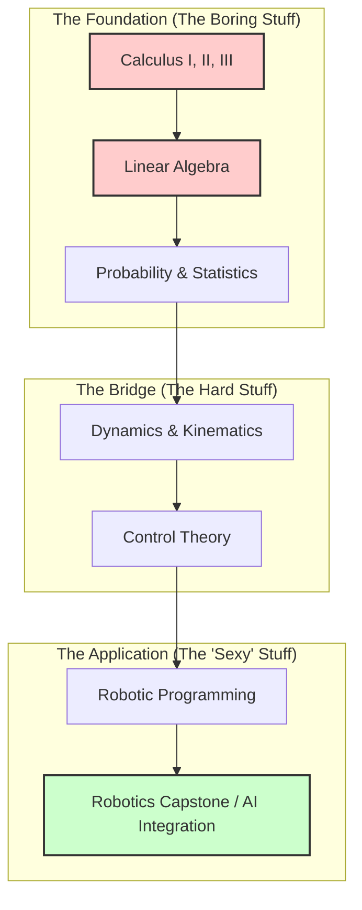

> *"Do not let subjects with 'dangerous' names like AI or Robotics lead you by the nose. The thing that will help you go far is not a buzzword, but the brutality of basic Mathematics and Physics."*

Hello everyone. It is October 2025.

We are living in an era where AI, Robotics, and Control Engineering are no longer science fiction concepts confined to movies like *Iron Man* or *Ex Machina*. They have become key industries, the literal backbone of modern industrialization. You don't need me to validate this. You just need to open your news feed every morning to see the naked truth: without these industries, society would stagnate.

But today, I am not here to sing praises about the glamour of the industry. I am not here to tell you how cool it is to build a humanoid.

From the perspective of a Mechatronics student—someone who has been "bruised and battered" by general education subjects, failed exams, retaken classes, and eventually found the light of knowledge in international resources—I want to share a different perspective. A perspective that might seem "contrarian," but serves as a compass for those who want to pursue a path of true Research.

This is a one-way conversation from me to you—those who might be lost in the maze of career orientation.

## The Trap of "Sexy" Names

What is the current reality? Students, and even fresh graduates, are often mesmerized by subjects or courses with incredibly loud, "dangerous," and attractive names like: *Advanced Robotic Engineering*, *Applied Artificial Intelligence*, or *Automated Control Systems XYZ*.

We often assume that to make a Robot, we must study a subject called "Robotics." To do AI, we must take a class called "AI Science."

But here is the brutal truth: **Do not trust those names completely.**

Those specialized subjects are often just a very small instance, a tiny slice of the overall picture of engineering science. If you focus solely on learning how to use a library (like TensorFlow or PyTorch), or learning how to code a line-following robot without understanding the roots, you are building a house on sand.

The things you truly need to care about, the things that help you learn *everything* in Robotics and AI, lie in the places you likely hate the most: the lecture halls of your first two years at university.

## The Difference Between the "Mechanic" and the "Research Engineer"

I am studying at a Polytechnic University (Bach Khoa). And the thing I am most grateful to the school for is not the flashy specialized subjects, but the fact that the school "tortured" us with general education subjects.

When I started accessing materials from top universities in the world like **MIT, Stanford, Berkeley, Carnegie Mellon, or Cambridge**, I realized a harsh reality: If you don't have a solid general foundation, reading their documents is like wandering into a maze without a map. You won't understand anything.

At top universities, their training process is very distinct. For example, at the University of Michigan, the roadmap to learning Robotics doesn't start with assembling a robot kit. It looks something like this:

You see, they teach Math for Robotics first. They teach **Data-Driven** approaches—a course that sounds very tech-heavy, but inside the syllabus, it is actually Probability & Statistics and extremely heavy Mathematics. They use Math to solve problems regarding genetic algorithms, protein chains, and only *then* do they move to control.

If you skip the pink boxes in the diagram above to jump straight to the green box, you aren't an engineer. You are a hobbyist.

## Robot Learning: The Era of Data and Models

The Robotics industry has evolved far beyond what we imagined about welding robot arms in factories in the 2000s. Currently, we are talking about **Robot Learning**.

Last September, at a Robot Learning conference held in South Korea—a place gathering genius minds from prestigious universities—I witnessed terrible problems being solved. It is no longer simply Forward Kinematics, Inverse Kinematics, or classical Dynamics.

Today, we combine **Model-based** (based on physical models) with **Data-driven** (based on data) approaches.

### 1. The Model-Based Reality
We still need classical methods like the Lagrange-Euler or Newton-Euler equations to build the dynamic equation of a robot. You cannot escape this equation:

$$ \tau = M(q)\ddot{q} + C(q, \dot{q})\dot{q} + G(q) + F(\dot{q}) $$

Where:
*   $\tau$ represents the torque applied to the joints.
*   $M(q)$ is the Inertia Matrix (mass distribution).
*   $C(q, \dot{q})$ represents Coriolis and Centrifugal forces.
*   $G(q)$ is the Gravity vector.
*   $F(\dot{q})$ represents friction.

If you don't know Calculus and Physics, this equation is just Greek letters to you. But to an engineer, this is the heartbeat of the machine.

### 2. The Data-Driven Revolution
However, physical models are never absolutely accurate. Friction is hard to model. Wear and tear change the physics. This is where **Learning** comes in. Techniques like *Reinforcement Learning* (RL) and *Imitation Learning* optimize the Control Policy.

To do this, you can't just know how to code Python. You need **Optimization Mathematics** (Convex Optimization, Gradient Descent). You need to understand how a loss function converges.

## The 6 "Ultimate Weapons" of an AI & Robotics Engineer

So, in summary, if you want to go the long distance, if you want to research deeply, if you want to read and understand documents from Europe to Asia, from the US to Australia, you need to equip yourself with the following.

The answer is not a new programming language. It is these 6 classic subjects:

### 1. Calculus I, II, III (Giải tích)
This is the study of change. How does the error in your robot's position change as you tweak a motor parameter? That's a derivative. How do you calculate the center of mass of a complex shape? That's an integral. Without Calculus, you cannot understand Backpropagation in Neural Networks.

### 2. Linear Algebra (Đại số tuyến tính)
If I had to pick one math subject that is the "language" of Robotics, it is this. Robots live in 3D space. To move a robot arm, you are multiplying matrices and vectors (Rotation Matrices, Homogeneous Transformations). In AI, datasets are essentially giant matrices. If you don't understand Eigenvalues and Eigenvectors, you don't understand stability.

### 3. Probability & Statistics (Xác suất thống kê)
The real world is messy. Sensors are noisy. A LiDAR sensor never gives you the exact distance; it gives you a probability distribution. Algorithms like Kalman Filters or Particle Filters—essential for self-driving cars—are pure probability.

### 4. Numerical Methods (Phương pháp tính)
How do you solve a differential equation that has no analytical solution? How do you simulate a robot in a computer before building it? You use numerical approximation.

### 5. General Physics (Vật lý đại cương)
You cannot code a machine to interact with the physical world if you don't understand the laws that govern that world.

### 6. Theoretical Mechanics (Cơ lý thuyết)
Statics and Dynamics. Forces, moments, inertia. This is the bridge between pure math and the physical robot.

---

Don't learn these just to pass the subject. Learn them to build **Mathematical Intuition**.

## Why "Intuition"?

I have retaken some subjects several times. It sounds bad, but thanks to learning them over and over, the knowledge soaked into my blood.

Now, I don't use Math to solve "student excellence" exam questions—if you gave me a test paper now, I might fail. But when I look at a technical problem, my intuition tells me which mathematical tool to use to model it.

For example, when you study *Reinforcement Learning*, if you don't have Linear Algebra and Probability, you will just be a "code mechanic" retyping soulless lines of code. But if you have the foundation, you will understand the nature of convergence, of the Loss Function.

Or take Graph Theory. When combined with *Heuristics*, it helps solve Path Planning problems (A*, Dijkstra, RRT) for autonomous vehicles or UAVs. This knowledge is not just for Robots; it is used for chip design, medical image processing, and dozens of other industries.

## Conclusion: Use AI to Learn the "Root"

It is 2025. Learning has become much easier thanks to the help of AI like ChatGPT or Claude.

In the past, I wondered who to ask when I was stuck. Now, you have a 24/7 tutor. But here is my advice: **Use AI to dig deep into mathematical principles, do not use it to do your homework for you.**

Ask ChatGPT: *"Explain the geometric intuition behind the Jacobian matrix in robotics."*
Don't ask: *"Write code to solve this homework."*

Don't let flashy buzzwords deceive you. Robotics or AI, in the end, is the beautiful crystallization of Mathematics and Physics. Fall in love again with the numbers, the theorems you once thought were dry. That is the master key that opens the door to the future.

In the next article, I will share about **Control Theory** from the perspective of **Indian experts**—a very different, very pragmatic, and interesting perspective compared to what we are usually taught in the West.

I hope you find joy in the equations!